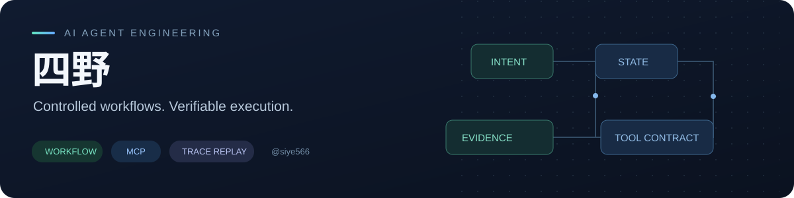
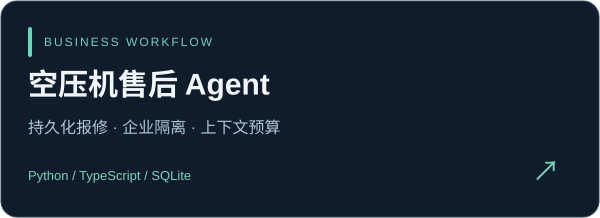
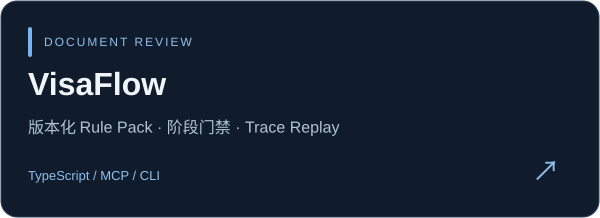

  

<h2 align="center">四野 · AI Agent Engineering</h2>

把业务流程做成可运行、可追踪、可核验的 Agent 系统。

  <a href="#精选项目">精选项目</a> ·
  <a href="#开源贡献">开源贡献</a> ·
  <a href="#工程关注">工程关注</a> ·
  <a href="https://github.com/siye566?tab=repositories">全部仓库</a>

电子信息硕士在读，广东工业大学。围绕 Python / TypeScript 开发 Agent 业务原型，关注 Workflow 编排、工具调用边界、持久化状态与评估回放；通过开源贡献处理运行时、路径和平台兼容问题。

## 精选项目

<table>
<tr>
<td width="50%" valign="top">
  
  
将报修、保养和进度查询组织为受控流程。保存待确认任务，校验企业与设备归属，记录上下文来源及预算，并提供离线流程 Benchmark。

  
<a href="https://github.com/siye566/fengyun-service-agent#快速体验">启动方法</a> · <a href="https://github.com/siye566/fengyun-service-agent/blob/main/docs/implementation-map.md">能力与源码</a> · <a href="https://github.com/siye566/fengyun-service-agent/blob/main/docs/validation.md">验证记录</a>

</td>
<td width="50%" valign="top">
  
  
将信息采集、类型判断、清单生成、材料核验和补正复核串成五阶段 Workflow。固定规则版本、保留字段证据，通过 MCP / CLI 执行并回放调用。

  
<a href="https://github.com/siye566/visaflow#启动方法">启动方法</a> · <a href="https://github.com/siye566/visaflow/blob/main/docs/workflow-and-tools.md">工具与流程</a> · <a href="https://github.com/siye566/visaflow/blob/main/docs/evaluation-report.json">评估报告</a>

</td>
</tr>
</table>

两项项目均提供脱敏或合成演示数据，并在仓库中说明实际实现、验证范围与待接入能力。

## 开源贡献

近期已合并的上游贡献，点击 PR 可查看具体代码与讨论。

| 项目 | 已合并的改动 | PR |
| --- | --- | --- |
| **deer-flow** | 本地沙箱子进程统一 UTF-8 解码 | [#5905](https://github.com/bytedance/deer-flow/pull/5905) |
| **deer-flow** | 拒绝带上标字符的 Windows 保留设备名 | [#6148](https://github.com/bytedance/deer-flow/pull/6148) |
| **deer-flow** | 无符号链接权限时保持浏览器资源检查可运行 | [#6267](https://github.com/bytedance/deer-flow/pull/6267) |
| **folio** | 为 Copilot 增加类型化金融回答展示块 | [#81](https://github.com/helsome/folio/pull/81) |
| **GLM-5** | 修复主技能目录中的失效链接 | [#157](https://github.com/zai-org/GLM-5/pull/157) |

进行中的贡献与完整记录

状态核验日期：2026-10-04。以下 PR 当时为 Open，后续状态以上游页面为准。

| 项目 | 改动方向 | PR |
| --- | --- | --- |
| Octop | Skill Manager 子进程输出统一 UTF-8 解码 | [#1590](https://github.com/TencentCloud/Octop/pull/1590) |
| AutoGPT | Copilot 执行已验证的图版本 | [#15162](https://github.com/Significant-Gravitas/AutoGPT/pull/15162) |
| E2B | 修正 dockerignore 前导 globstar 后的字面后缀匹配 | [#1934](https://github.com/e2b-dev/E2B/pull/1934) |

[全部 PR](https://github.com/pulls?q=is%3Apr+author%3Asiye566) · [已合并 PR](https://github.com/pulls?q=is%3Apr+author%3Asiye566+is%3Amerged)

## 工程关注

| 方向 | 实践重点 |
| --- | --- |
| **Workflow & State** | 阶段许可、持久化任务、澄清与确认、失败后可恢复 |
| **Tool Contracts** | 结构化输入输出、可信身份绑定、写操作门禁与作用域校验 |
| **Context & Evidence** | 分段上下文、预算控制、规则来源、文件位置与证据引用 |
| **Eval & Replay** | 正常/错误/模糊样例、状态核验、调用追踪与版本漂移检测 |

贡献足迹

<picture>
  <source media="(prefers-color-scheme: dark)" srcset="https://raw.githubusercontent.com/siye566/siye566/output/snake-dark.svg" />
  <source media="(prefers-color-scheme: light)" srcset="https://raw.githubusercontent.com/siye566/siye566/output/snake.svg" />
  
</picture>

Build the workflow. Keep the evidence. Make it reproducible.

